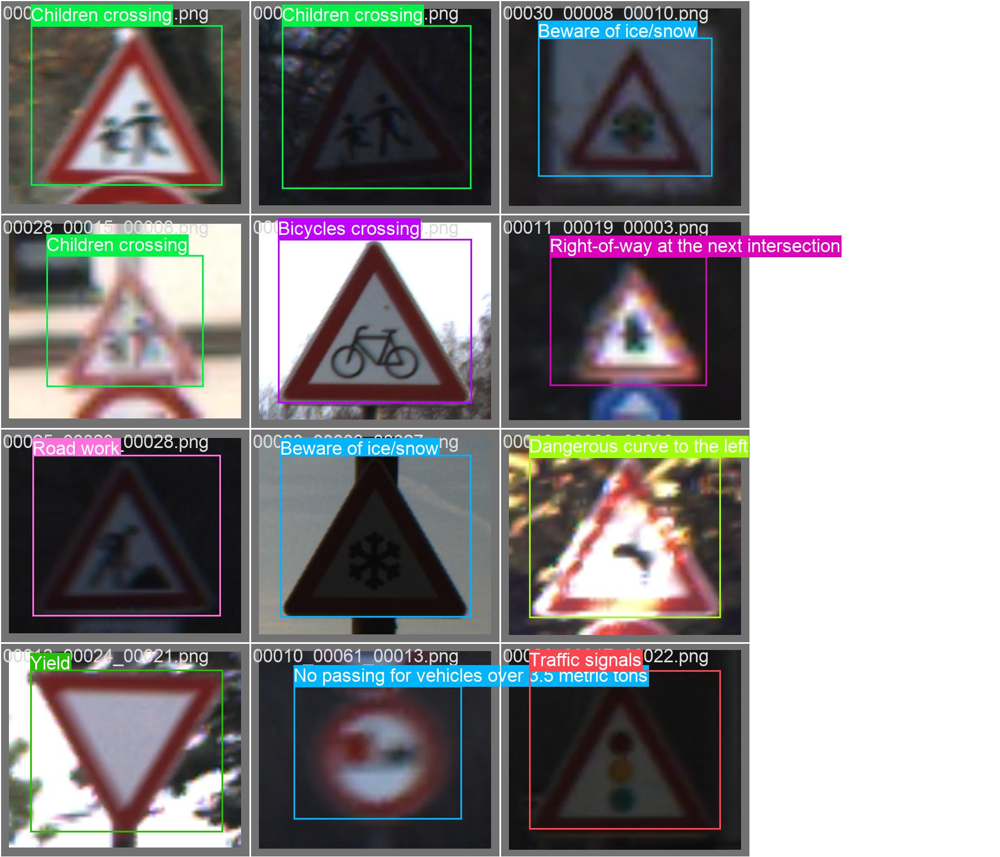
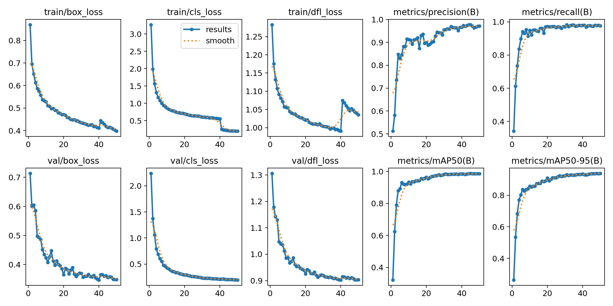
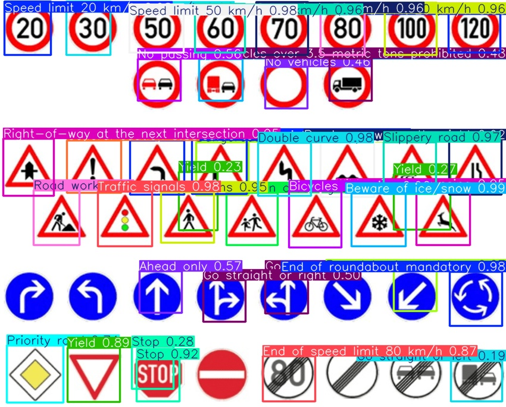
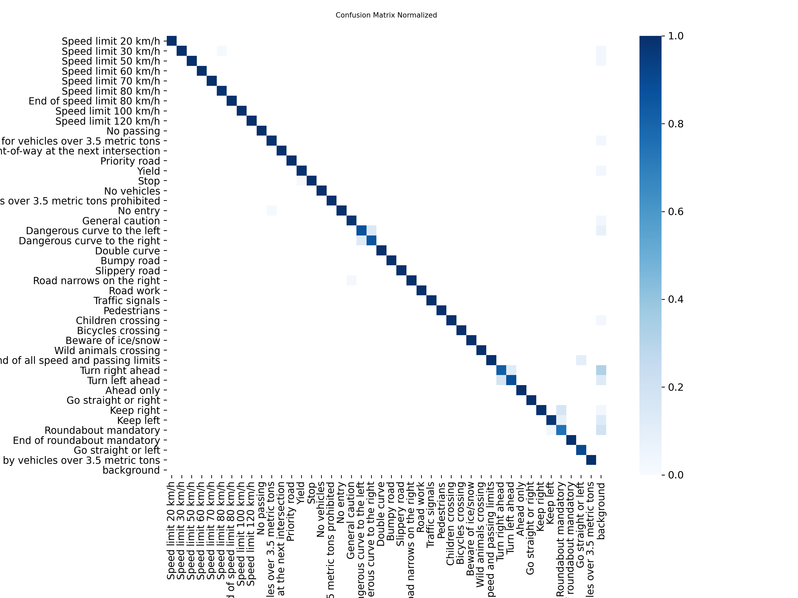

# Real-Time Traffic Sign Recognition

[](https://www.python.org/)  
[](https://docs.ultralytics.com)  

This project implements a **real-time traffic sign recognition system** using **YOLOv8 Nano / YOLOv8n2** and the **German Traffic Sign Recognition Benchmark (GTSRB)** dataset from [Kaggle](https://www.kaggle.com/datasets/meowmeowmeowmeowmeow/gtsrb-german-traffic-sign).

---

## Dataset

- **Training images:** 39,209  
- **Mini dataset for training:** 7,840 images  
- **Validation images:** 1,560 images  
- **Remaining images (original + flipped):** 12,630  
- **Classes:** 43 traffic sign categories  

The dataset contains a CSV file with all images, which includes the following columns:

```

Width, Height, Roi.X1, Roi.Y1, Roi.X2, Roi.Y2, ClassId, Path

```

These are converted to **YOLO TXT format** using the script [`change_CSV_into_TXT.py`](link-to-script), where each TXT file contains:

```

class_id x_center_norm y_center_norm width_norm height_norm

````



---

## Environment Setup

1. **Create a Python virtual environment:**

```bash
python -m venv yolov8_env
````

2. **Activate the environment:**

* Windows:

```bash
yolov8_env\Scripts\activate
```

* Linux/macOS:

```bash
source yolov8_env/bin/activate
```

3. **Upgrade pip:**

```bash
pip install --upgrade pip
```

4. **Install YOLOv8 and Ultralytics packages:**

```bash
pip install ultralytics
pip install yolov8n2
```


## Data Preparation

1. Convert CSV labels to YOLO TXT format using [`change_CSV_into_TXT.py`](https://github.com/itsmenisha/Real-Time-Traffic-Sign-Recognition/blob/main/changethe-csv-into-txt.py).

2. Create the following folder structure:

```
dataset/
  images/
    train/
    val/
  labels/
    train/
    val/
```

3. Place images in `images/train` and `images/val`, and corresponding TXT labels in `labels/train` and `labels/val`.

4. Prepare the **mini dataset** using [`prepare-dataset.py`](https://github.com/itsmenisha/Real-Time-Traffic-Sign-Recognition/blob/main/prepare_dataset.py). This script performs sampling, flipping, and organizes images for faster training.


6. Configure YOLO with [`minidataset.yaml`](https://github.com/itsmenisha/Real-Time-Traffic-Sign-Recognition/blob/main/mini_dataset.yaml):

```yaml
train: path/to/dataset/images/train
val: path/to/dataset/images/val

nc: 43
names: ['Speed_limit_20','Speed_limit_30','Speed_limit_50', ..., 'End_of_no_overtaking']
```

> Keep class names short and consistent.(Mine is too long)

---

## Training

Train YOLOv8 Nano / YOLOv8n2 using [`train_yolo.py`](https://github.com/itsmenisha/Real-Time-Traffic-Sign-Recognition/blob/main/train_yolo.py):




**Notes:**

* CPU training is very slow (~32 hours). GPU is highly recommended.
* `augment=True` helps generalization.
* `patience=10` allows early stopping if the model stops improving.

---

## Inference

Run inference with [`showresults.py`](https://github.com/itsmenisha/Real-Time-Traffic-Sign-Recognition/blob/main/show_results.py):

```python
from ultralytics import YOLO

model = YOLO("path/to/best.pt")

results = model.predict(source="path/to/images_or_video", save=True)
```




* `source` can be an image, folder, or video.
* there is also a testing data in the germen dataset.
* Results include bounding boxes and predicted class labels drawn on images.

---

## Folder Structure

```
Real-Time-Traffic-Sign-Recognition/
│
├─ dataset/
│   ├─ images/
│   │   ├─ train/
│   │   └─ val/
│   └─ labels/
│       ├─ train/
│       └─ val/
│
├─ change_CSV_into_TXT.py     # CSV to YOLO TXT conversion
├─ prepare-dataset.py         # Mini dataset preparation
├─ train_yolo.py              # Training script
├─ showresults.py             # Inference script
├─ minidataset.yaml           # Dataset configuration for YOLO
└─ README.md
```

---

## Future Improvements




* Train on GPU for faster results.(Using Google colab)
* Use YOLOv8 Small or Medium for higher accuracy.
* Improve data augmentation (rotations, brightness, scaling, mosaic).
* Standardize class names.
* Use the full dataset for final training.
* Explore post-processing improvements (confidence thresholds, NMS optimization).

---

## References

1. [GTSRB Dataset on Kaggle](https://www.kaggle.com/datasets/meowmeowmeowmeowmeow/gtsrb-german-traffic-sign)
2. [Ultralytics YOLOv8 Documentation](https://docs.ultralytics.com)
3. [YOLOv8 Pretrained Models](https://github.com/ultralytics/ultralytics)


